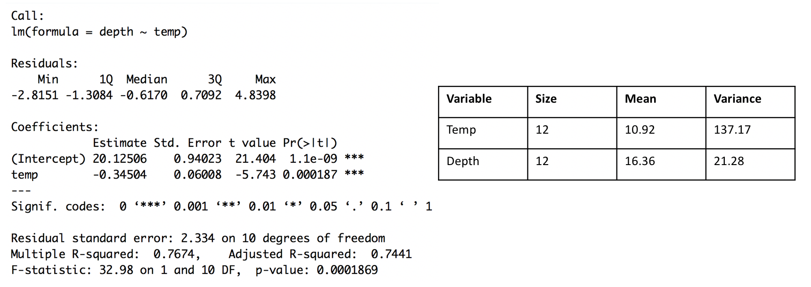

```{r setup, include=FALSE}
knitr::opts_chunk$set(echo = TRUE)
```

> Submit your homework to Canvas by the due date and time. Homework will be accepted for full credit until **Friday May 5th at 11:59pm.**

> If an exercise asks you to use R, include a copy of the code and output. Please edit your code and output to be only the relevant portions.

> If a problem does not specify how to compute the answer, you many use any appropriate method. I may ask you to use R or use manually calculations on your exams, so practice accordingly.

> You must include an explanation and/or intermediate calculations for an exercise to be complete.

> Be sure to submit the HWK 11 Auto grade Quiz which will give you ~20 of your 40 accuracy points.

>> 50 points total: 40 points accuracy, and 10 points completion

## Inference from a Fitted Least Squares Simple Regression Model
## Chi Square Hypothesis Tests for Categorical data

**Exercise 1**  Reconsider the relationship between city air particulate and rates of childhood asthma first discussed in HWK 10. We sampled 15 cities for particulate measured in parts-per-million (ppm) of large particulate matter and for the rate of childhood asthma measured in percents. The data are as follows:

|variable ||||||||||||||||
|-| -|-|-|-|-|-|-|-|-|-|-|-|-|-|-|
|part (x) | 11.6 | 15.9 |  15.7 |  7.9 |  6.3 |  13.7 |  13.1 |  10.8 | 6.0 |  7.6 |  14.8 |  7.4 | 16.2 |  13.1 |  11.2 | 
| asth (y) |  14.5 |  16.6 |  16.5 |  12.6 |  12.0 |  15.8 |  15.1 |  14.2 | 12.2 |  13.1 |  16.0 |  12.9 |  16.4 |  15.4 |  14.4 |

| variable: |  size |   mean |  variance | 
| - |- | - | -|
| particulate |  15 |  11.42 |  13.05029 | 
| asthma |  15 |  14.51333 |  2.635524 | 


> a. Suppose we sample a new city whose particulate is **13 ppm**. If reasonable, create a 95\% *prediction interval* for the predicted rate of childhood asthma in this city. If not reasonable, explain why.

This is a reasonable particulate level to construct a prediction interval for using this model because it is within the range of the sampled values the regression model is calculated off of, so we are allowed to use the model for a prediction for 13ppm particulate level.

From HW10: $\hat{\beta_0}=9.41626$ and $\hat{\beta_1}=0.44633$

Point Estimate: $\hat{y}(x^*) = \hat{\beta_0}+\hat{\beta_1}x* = 9.41626+0.44633(13) = 9.41626+5.80229 = 15.21855$

```{r}
qt(.025, 13, lower.tail=FALSE) #critical value
0.1963 # residual standard error from HW10
0.1963*sqrt(1+1/15+(13-11.42)^2/(13.05029)^2*14)
2.160369*0.2213824

2.160369*0.1963*sqrt(1+1/15+(13-11.42)^2/(13.05029)^2*14) 
```

Prediction Interval:

lower = $15.21855-0.4782677=14.74028$

upper = $15.21855+0.4782677=15.69682$

> b. Create a *95\% confidence interval* for the average rate of childhood asthma among cities with **10 ppm** of large particulate. Is this confidence interval wider or narrower than a *95% prediction interval* for the rate of childhood asthma in the next city with **10 ppm** of large particulate? Explain why their relative sizes makes sense.

Point Estimate: $\hat{y}(x^*) = \hat{\beta_0}+\hat{\beta_1}x* = 9.41626+0.44633(10) = 9.41626+4.4633 = 13.87956$

```{r}
qt(.025, 13, lower.tail=FALSE) #critical value
0.1963 # residual standard error from HW10
0.1963*sqrt(1/15+(10-11.42)^2/(13.05029)^2*14)
2.160369*0.09463631

2.160369*0.1963*sqrt(1/15+(10-11.42)^2/(13.05029)^2*14) 
```

Confidence Interval:

lower = $13.87956-0.2044494=13.67511$

upper = $13.87956+0.2044494=14.08401$

The confidence interval is narrower than a prediction interval at the same x. Prediction intervals are meant to provide a range for where a single value may lie while a confidence interval is meant to find a range from a mean value. Since predicting a single individual value has more uncertainty that predicting an average of values, the prediction interval will be wider than the confidence interval for the same x value. 

> c. If reasonable, create a 95\% interval for the predicted rate of childhood asthma in the next city sampled that has **3 ppm** of large particulate. If not reasonable, explain why.

Because the particulate level of 3 ppm is far from the range of particulate levels the collected sample data is for, we should not use this model to predict asthma rate for a city with 3 ppm of particulate. We cannot be certain that the relationship between particulate levels and childhood asthma rate is the same as we calculated for a particulate level that is far out of the sample range.

\vspace{.5cm}

**Exercise 2** In the paper "Artificial Trees as a Cavity Substrate for Woodpeckers", scientists provided polystyrene cylinders as an alternative roost. The paper related values of x=ambient temperature (C) and y=cavity depth(cm). A scatterplot in the paper showed a strong linear relationship between x and y. The summary for a linear model fit (depth $\sim$ temp) in R is given below. 



> a. Determine the Pearson's sample correlation (r) from the summaries given.

slope = $\beta_1= -0.34504=\frac{rs_y}{s_x}$

$r = \frac{\beta_1s_x}{s_y} = \frac{-0.34504(\sqrt{137.17})}{\sqrt{21.28}}= \frac{-0.34504(11.71196)}{4.613025} = \frac{-4.041095}{4.613025} = -0.8760184$

> b. Write the linear regression model with least squares estimates for y-intercept: $\beta_0$ and slope: $\beta_1$ relating ambient temperature (x) and hole depth (y). Interpret the slope and y intercept values in the context of the question. 

>> Slope: 

$\beta_1= -0.34504$

>> Y-Intercept: 

$\beta_0= 20.12506$

Depth = 20.12506-0.34504(Temp)

The depth of the hole at ambient temperature of 0 degrees Celsius is predicted to be 20.12506 cm according to our model. The depth of the hole also decreases by 0.34504 cm for every 1 degree increase in temperature. 

> c. Determine test statistics and p values for the tests in parts c-f. Then draw a conclusion in the context of the question using an $\alpha=0.05$. 

>> c1. $H_o: \beta_1=0$ vs $H_A: \beta_1 \ne 0$ 

$T= \frac{(-0.34504-0)}{SE(\beta_1)}=\frac{(-0.34504)}{0.06008}=-5.743009$

p value = 0.000187 (from the Coefficients table above)

The p value is less than the significance level $(0.000187 \le 0.05)$, so we have enough evidence to reject the null hypothesis and say that the slope is not equal to 0.

>> c2. $H_o: \beta_1 \ge 0$ vs $H_A: \beta_1 < 0$ 

Test stat is same as above: $T= \frac{(-0.34504-0)}{SE(\beta_1)}=\frac{(-0.34504)}{0.06008}=-5.743009$

```{r}
pt(5.743009, df = 10, lower.tail = FALSE)
```

p value = 0.00009347

The p value is less than the significance level $(0.00009347 \le 0.05)$, so we have enough evidence to reject the null hypothesis and say that the slope is less than 0.

>> c3. $H_o: \beta_1 \le 0$ vs $H_A: \beta_1 > 0$ 

Test stat is same as above: $T= \frac{(-0.34504-0)}{SE(\beta_1)}=\frac{(-0.34504)}{0.06008}=-5.743009$

```{r}
pt(5.743009, df = 10, lower.tail = TRUE)
```

p value = 0.9999065

The p value is greater than the significance level $(0.9999065 \ge 0.05)$, so we fail to reject the null hypothesis which states that the slope is less than or equal to 0.

>> c4. $H_o: \beta_1=-0.5$ vs $H_A: \beta_1 \ne -0.5$ 

$T= \frac{(-0.34504-(-0.5))}{SE(\beta_1)}=\frac{(0.15496)}{0.06008}= 2.579228$

```{r}
2*pt(2.579228, df = 10, lower.tail = FALSE)
```

p value = 0.02745264

The p value is less than the significance level $(0.02745264 \le 0.05)$, so we have enough evidence to reject the null hypothesis and say that the slope is not equal to -0.5.
	
> d. Compute and interpret a 98\% confidence interval for the slope of the regression line $\beta_1$. 

point estimate: -0.34504

```{r}
qt(0.01, df = 10, lower.tail = FALSE)
```

critical value = 2.763769

upper bound = $-0.34504+2.763769*0.06008=-0.1789928$

lower bound = $-0.34504-2.763769*0.06008=-0.5110872$

The confidence interval is from -0.1789928 to -0.5110872. This means we are 98% confident that the true slope of the regression line is between -0.1789928 and -0.5110872. For the hypothesis tests above, 0 is not in the slope, so we can reject the null hypothesis of slope being equal to 0 at the 98% level. However, -0.5 is in the interval, so we fail to reject the null hypothesis of the slpoe being equal to -0.5 at the 98% level.
	
\vspace{.5cm}	


**Exercise 3** A player in a gambling game rolls two dice and wins an amount dependent on the number of ones rolled. Let X be the number of ones rolled in two dice, assuming the dice are 6 sided and fair.

> a. Show/explain why the following table gives the probability distribution for X:

| x | P(X=x) |
|:-:|:-:|
|0| 25/36 |
|1| 10/36 |
|2| 1/36 |

All of the fractions in the table added together equal 1, so each fraction represents a fraction of the time the number of ones will be rolled in two die. 


The player plays (rolls two dice) 250 games and records these results:

| Number of 1s | Number of Games |
|:-:|:-:|
|0| 160 |
|1| 70 |
|2| 20 |

> b. Consider conducting a hypothesis test to gather evidence of whether the dice are fair based on these 250 games and the proportion of ones that would be rolled in fair die. That is, conduct a hypothesis test of $H_o: \pi_0=25/36, \pi_1=10/36, \pi_2=1/36$ and $H_A:$ at least one proportion of outcomes does not match.

>> bi. Compute the test statistic for the hypothesis given above. Be sure to show your expected counts and your test statistic computation. 

Expected Counts: 

| Number of 1s: | 0 | 1 | 2 |
|:-:|:-:|:-:|:-:|
|Number of Games: | $25/36*250=173.6111$ | $10/36*250=69.44444$ | $1/36*250=6.944444$ |

Test stat: $\chi^2=\frac{(160-173.6111)^2}{173.6111}+\frac{(70-69.44444)^2}{69.44444}+\frac{(20-6.944444)^2}{6.944444}=1.067109+0.004444516+24.54444=25.61599$

>> bii. Compute the degrees of freedom and p-value for the hypothesis test. Interpret the results in context.

Degrees of freedom: v = (num of categories)-1 = 3-1 = 2

```{r}
pchisq(25.61599, 2, lower.tail = FALSE)
```

p-value: 2.738788e-06

The p value is very small and is much smaller than the commonly used significance level of 0.05. Therefore we have enough evidence to reject the null hypothesis and say that there is at least one proportion that does not match the given null proportions. 

\vspace{.5 cm}

**Exercise 4** The table below gives data on the 1083 participants in a vaccine trail. Of the 549 patients who received the vaccine, 11 developed type B hepatitis. Of the 534 patients who did not receive the vaccine, 70 developed the virus. Do these data indicate that there is a different distribution of hepatitis between vaccinated and not vaccinated participants?

|          | Hepatitis | No Hepatitis | Total |
|----------|-----------|--------------|-------|
|Vaccinated| 11        | 538          | 549   |
|Not Vaccinated | 70   | 464          | 534   |
|-----------|----------|--------------|-------|
|Total      | 81       | 1002         | 1083  |

> a. Use the $\chi^2$ test for homogeneity to gather statistical evidence for your question of interest. Compute the Test Statistic, Degrees of Freedom, and p value, and interpret your findings in the context of the question. (If using chisq.test(), use correct=FALSE)

>> Hypotheses

$H_0$: The proportion of occurrence of hepatitis B between vaccinated and not vaccinated participants are the same.

$H_A$: At least one of the populations is not the same. 

>> Test Statistic, p value, and conclusion:

Expected counts: 

(Vaccinated, Hepatitis): $(549*81)/1083=41.06094$

(Vaccinated, No Hepatitis): $(549*1003)/1083=508.446$

(Not Vaccinated, Hepatitis): $(534*81)/1083=39.93906$

(Not Vaccinated, No Hepatitis): $(534*1003)/1083=494.554$

Test Stat: $\chi^2= \frac{(11-41.06094)^2}{41.06094} + \frac{(538-508.446)^2}{508.446} + \frac{(70-39.93906)^2}{39.93906} + \frac{(464-494.554)^2}{494.554} = 22.00778+1.71786+22.62597+1.887654= 48.23926$

Degrees of Freedom: $(2-1)*(2-1)=1*1=1$

```{r}
pchisq(48.23926, 1, lower.tail = FALSE)
```

p value: 3.772588e-12

The p value is very small, much smaller than the typical significance level of 0.05, so we have strong evidence to reject the null hypothesis and say that there is at least one proportion that is not the same. 

> b. Use the appropriate Z test for testing the equality of the proportion of patients who develop type B hepatitis across the vaccinated and unvaccinated populations with a two-sided alternative. Verify the relation $\chi^2=Z^2$ by comparing the observed test statistics' numeric values to those found in part (a).

>> Hypotheses: 

$H_0:$ The proportion of getting hepatitis B is the same between the two populations of vaccinated individuals and not vaccinated individuals.

$H_A:$ The proportion of hepatitis between between vaccinated individuals and unvaccinated individuals is not the same.

>> Test Statistic, p value, and conclusion:

$\hat{p_1}=11/549=0.02003643$

$\hat{p_2}=70/534=0.1310861$

$\hat{p}=(11+70)/(549+534)=0.07479224$

Test stat: $Z = \frac{(\hat{p_1}-\hat{p_2})-0}{\sqrt{\hat{p}(1-\hat{p}(\frac{1}{n_1}+\frac{1}{n_2}))}} = \frac{(0.02003643-0.1310861)-0}{\sqrt{0.07479224(1-0.07479224)(\frac{1}{549}+\frac{1}{534})}}  = \frac{-0.1110497}{\sqrt{0.07479224(0.9252078)(0.003694153)}} = \frac{-0.1110497}{\sqrt{0.01598841}} = -6.945637$

```{r}
2*pnorm(-6.945637, lower.tail = TRUE)
```

p-value: 3.767564e-12

The p value is very small and also very close to the calculated p value in part (a). Therefore, we come to a similar conclusion, in that we reject the null hypothesis and say that the proportion of hepatitis in the two populations is not the same. 

$Z^2 = (-6.945637)^2=48.24187$

$\chi^2=48.23926$

$\chi^2=48.24=48.24=Z^2$

> c. If the alternative is that the rate of hepatitis is lower for the vaccinated group, which of the two testing strategies should be used?

We should use the Z test for two sample difference in population proportion to test that the rate of hepatitis is lower for the vaccinated group. The $\chi^2$ test for homogeneity is meant to be used for samples from populations with many categories and thus can only tell if one of the proportions for one category is unequal. On the other hand, two sample Z tests only work for two sample proportions but we are able to test whether one is greater than, less than, or not equal to the other. 

