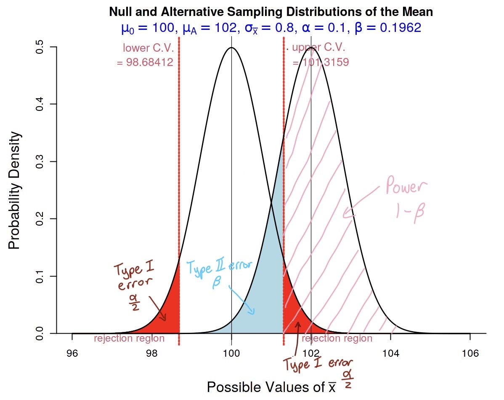

```{r setup, include=FALSE}
knitr::opts_chunk$set(echo = TRUE)
```

*Submit your homework to Canvas by the due date and time. Email your instructor if you have extenuating circumstances and need to request an extension. 

*If an exercise asks you to use R, include a copy of the code and output. Please edit your code and output to be only the relevant portions.

*If a problem does not specify how to compute the answer, you many use any appropriate method. I may ask you to use R or use manually calculations on your exams, so practice accordingly.

*You must include an explanation and/or intermediate calculations for an exercise to be complete.

*Be sure to submit the HWK6 Auto grade Quiz which will give you ~20 of your 40 accuracy points.

*50 points total: 40 points accuracy, and 10 points completion


## Hypothesis Testing for $\mu$ using Z, T or Bootstrap. Computing power and Sample Size 


**Exercise 1.** From extensive testing, the mean drying time of a company's spray paint product is thought to be normally distributed with mean $\mu=100$ seconds and standard deviation of $\sigma=4$ seconds. The manager of the research division of the company that produces the paint considers using a different colorant and wants to know whether the mean drying time will change.

> a. Write out the manager's question in terms of a null $H_o$ and alternative hypotheses $H_a$ about the population mean $\mu$ drying time using the new colorant

$H_0:$ $\mu=100$ seconds

$H_a:$ $\mu\neq100$ seconds

\vspace{.5cm}

> b. If the managers choose to use a significance level of $\alpha= 0.10$ and assume $\sigma=4$, identify the power of a Z test to detect a mean increase of 2 seconds ($\mu_a=102$). They plan to look at a sample of 25 drying times and do a two-sided hypothesis test. Also identify the probability of making a type 2 error if the true mean drying time with the new colorant is 102 seconds, $\mu_a=102$. 

```{r}
#lower RR using significance of 0.10 and hypothesis mu value of 100
qnorm(.05, 100, 4/sqrt(25))

#upper RR
qnorm(.95, 100, 4/sqrt(25))

#power with alternative mean of 102
pnorm(98.68412, 102, 4/sqrt(25), lower.tail = TRUE) + pnorm(101.3159, 102, 4/sqrt(25), lower.tail = FALSE)
```

Power of the Z test is 0.803776. The probability of a type 2 error is thus $1-0.803776=0.196224$.

\vspace{.5cm}

> c. Draw pictures of the null and alternative distributions of the sampling distribution of the sample mean ($\bar{X}$) and shade and label the areas that correspond to (i) Type 1 error, (ii) Type 2 error, and (iii) Power from part (b). (You can also use the online applet as long as you label which parts of the picture correspond to what quantity.)



I've also uploaded the graph to canvas just in case there is an error and the graph doesn't show up.

\vspace{.5cm}

> d. Describe Type 1 and Type 2 errors of the test in context.

Type 1 error would occur if the null hypothesis is rejected when it should not be. In this situation, this would mean that the hypothesis test with the given sample had statistically significant results that the mean drying time of the new spray paint is different from 100 seconds, but the true population mean when measured is 100 seconds as proposed by the null hypothesis, meaning the result of the test was purely due to chance. 

Type 2 errors occur when the null hypothesis fails to be rejected even when it should be. In this context, this means that the mean drying time of the sample of new spray paint is found to not differ from the null hypothesis mean of 100 seconds, but the true population mean of drying time is actually not equal to 100 seconds. 

\vspace{.5cm}

> e. What sample size should the managers use to ensure their $10\%$ level 2-sided Z test has power of at least 0.9 to detect a true mean drying time of 102 ounces (assuming $\sigma=4$)?

Equation: $n\approx(\frac{\sigma(z_{\frac{\alpha}{2}}+z_{\beta})}{\mu_0-\mu_a})^2$

```{r}
alpha = qnorm(.95)
beta = qnorm(.90)
sigma = 4

(sigma * (alpha + beta) / 2)^2
```

The managers should choose a sample size of 35 to ensure a power of at least 0.9.

\vspace{.5cm}

> f. Use the R function power.t.test() to recompute the power and type 2 error rate in (b) and the sample size in (e) assuming a **t test** will be run. Discuss how these values compare to the values computed assuming a Z test statistic and why that makes sense based on what we claim to "know" with each of them. 

```{r}
#power with sample size n=25
power.t.test(n=25, delta=2, sd=4, sig.level=0.10, power=NULL, 
             type="one.sample", alternative="two.sided", 
             strict=TRUE)

#sample size with 90% power
power.t.test(n=NULL, delta=2, sd=4, sig.level=0.10, power=0.90, 
             type="one.sample", alternative="two.sided", 
             strict=TRUE)
```
Power from a t test is 0.7834089. Then type 2 error rate is $1-0.7834089=0.2165911$.

The sample size to get a power of 90% is 36.

A z test assumes that the standard deviation we know is the population standard deviation, while a t test assumes the population standard deviation is unknown, and thus it must be estimated using the sample standard deviation. Using the sample standard deviation introduces more uncertainty to the calculation, thus the test is not as powerful, the type 2 error rate is higher, and a larger sample size is needed to maintain the power.

\vspace{1cm}


Suppose the managers collect a random sample of 41 drying times from the paint with the new colorant to test the hypotheses: $H_o: \mu = 100$ versus $H_a: \mu \ne 100$ at a $\alpha = 10\%$ significance level. They still believe it is reasonable to assume the distribution of drying times should be approximately normal, but they are not going to assume they know $\sigma$. The collected drying times can be found in the "Drytimes.csv" file on Canvas.


> g. Evaluate whether the assumptions of the t test are reasonably met.

1. Population mean and population standard deviation are both unknown in this situation. We do not assume that we know $\sigma$.

2. The sample collected is claimed to be a random sample of 41 drying times by the managers.

3. We assume that the population is large enough, 10*41, so that each data point is considered independent.

4. The sample size is large enough so that the sample mean distributions are approximately normal. 41 is greater than 30, so we can assume the distribution is approximately normal. 

\vspace{.5cm}

> h. Compute a t test statistic and p value and draw a conclusion for the hypothesis test $H_o: \mu = 100$ versus $H_a: \mu \ne 100$  at a 10\% level. (I would recommend you do this "by hand" and also with an R function to check your work)

```{r}
Drytimes_csv=read.csv("Drytimes.csv", header=TRUE)
times = Drytimes_csv$seconds

t.test(times, mu=100, alternative = "two.sided", conf.level = .90)

#by hand
(mean(times)-100)/(sd(times)/sqrt(41))
pt(-1.433741, df=40)*2
```

The p-value of the t test is 0.1594. Because the p-value is greater than the significance level of 0.10, we determine that the results of the t test are not statistically significant and thus we cannot reject the null hypothesis of $\mu=100$

> i. Perform a bootstrap hypothesis test of $H_o: \mu = 100$ versus $H_a: \mu \ne 100$ at the 10\% level. 

```{r}
bootstrap=function(x,n.boot){
n<-length(x)
x.bar<-mean(x)
t.hat<-rep(0, n.boot) #create vector that we will fill with "t" values
for (i in 1:n.boot){
  x.star<-sample(x, size=n, replace=TRUE)
  x.bar.star<-mean(x.star)
  s.star<-sd(x.star)
  t.hat[i]<-(x.bar.star-x.bar)/(s.star/sqrt(n))
}
return(t.hat)
}

#bootstrap
times.boot<-bootstrap(x=times, n.boot=5000)
(t.obs = (mean(times) - 100)/(sd(times)/sqrt(length(times))))

#pvalue
m_U=sum(times.boot>=t.obs) #area at/above
m_U
(m_L=sum(times.boot<=t.obs)) #area at/below

#two-sided p value
p=2*min(m_U,m_L)/5000
cat('Bootstrap p-value =', p)
```

\vspace{.5cm}

> j. Explain why using the t, z, or bootstrap tools are all reasonable in this testing scenario.

Bootstrap is ok to use as long as the sample is random and iid, which it is in this scenario. Bootstrap does not require the sampling distribution to be approximately normal.

T testing is used when we don't want to assume the population standard deviation. It also needs the sample size to be large enough so the sampling distribution is approximately normal along with the bootstrap requirements. If that can be achieved, which it can in this testing scenario, then t testing is reasonable to use. 

Z testing would be ok in this scenario because we are given a population standard deviation, $\sigma=4$, that can be used to calculate the z value. Since the requirements for the other tools are fulfilled and we know the population standard deviation, we can use z test.

\vspace{.5cm}
\vspace{1cm}

**Exercise 2** The p-value for a two-sided t test of the hypotheses $H_0: \mu=12$, $H_A: \mu \ne 12$ is 0.03.

> a. Does the 99\% [two-sided] t confidence interval for $\mu$ using this same sample include 12? Why or why not?

A 99% confidence interval means that $\alpha=0.01$. Then the p-value for the two-sided t test is greater than the confidence level. This means that we cannot reject the null hypothesis and the 99% confidence interval contains the null hypothesis value of $\mu=12$.

\vspace{.5cm}

> b. Does the 95\% [two-sided] t confidence interval for $\mu$ using this same sample include 12? Why or why not?

The 95% confidence interval means $\alpha=0.05$. A p value of 0.03 is then less than the confidence level, so we would reject the null hypothesis and the 95% confidence interval does not contain the value of $\mu=12$.

\vspace{.5cm}


\vspace{1cm}


**Exercise 3** Permethrin is a chemical that is recommended as a way of controlling insects. One study on the effectiveness of Permethrin on plant leaves inspected 96 plants and reported a 90\% t confidence interval of: (6.132, 8.268) for the average number of insects on plants treated with Permethrin. 

> a. What would be the test statistic and p value obtained if the researchers had instead used their sample data study for a t hypothesis test of $H_o: \mu \ge 9$ vs $H_A: \mu < 9$? 

```{r}
n=96
t_value=qt(0.05,95, lower.tail = FALSE)
#sample mean
x_bar=(6.132+8.268)/2
#sample sd
s=((8.268-x_bar)/t_value)*sqrt(96)
s 

#test statistic
t=(x_bar-9)/(s/sqrt(96))
t
#p value
pt(t, df=95, lower.tail = TRUE)
```

Test statistic = -2.799526.

P value = 0.003099479

\vspace{.5cm}

> b. Explain how you could know that the p value for the one-sided hypothesis test $H_o: \mu \ge 9$ vs $H_A: \mu < 9$ was less than 5\% just by seeing that both confidence interval bounds were below $\mu=9$.

Since the confidence interval calculated was at 90% confidence and is double sided, we know that the rejection region at each end of the interval is 5%. And then, since the alternative hypothesis is $H_A: \mu < 9$, the hypothesis test is one-sided, thus the rejection region is just the 5% at the lower tail. Since the interval does not contain the null hypothesis mean value of 9, the interval is in the rejection region, and we know that the p value will be less than the significant level, so p value < 0.05. 

